# 002 Context Auto-Rotation — End-to-End Flowchart

**Date:** 2026-03-10 (updated from 2026-03-09)
**Covers:** All happy paths, unhappy paths, race conditions, and crash recovery (SIGKILL/lid close)
**Updates:** FR-032 double-/clear guard, 60s poller timeout (was 30s), banner before /clear

> Render with any Mermaid viewer (GitHub markdown, VS Code extension, mermaid.live).
> Uses dark theme with high-contrast colors. If rendering in a light-themed viewer,
> the `%%{init}%%` block can be removed.

## Main Operational Flow

```mermaid
%%{init: {'theme': 'dark', 'themeVariables': {'fontSize': '16px', 'fontFamily': 'Consolas, monospace', 'lineColor': '#ecf0f1', 'primaryTextColor': '#ecf0f1'}}}%%

flowchart TD
    classDef ok fill:#0d6b38,stroke:#2ecc71,color:#fff,stroke-width:2px,font-weight:bold
    classDef warn fill:#7d5a00,stroke:#f1c40f,color:#fff,stroke-width:2px,font-weight:bold
    classDef fail fill:#7a0000,stroke:#e74c3c,color:#fff,stroke-width:2px,font-weight:bold
    classDef decide fill:#1a3a6c,stroke:#5dade2,color:#ecf0f1,stroke-width:2px,font-weight:bold
    classDef proc fill:#2c2c2c,stroke:#bdc3c7,color:#ecf0f1,stroke-width:1px
    classDef signal fill:#4a148c,stroke:#bb86fc,color:#fff,stroke-width:2px
    classDef crash fill:#b34700,stroke:#ff8c00,color:#fff,stroke-width:2px

    START(["Model writes CARRYOVER file<br/>PostToolUse hook fires"]):::proc

    START --> A

    %% ═══════════════════════════════════════════════════════
    %% PHASE 1 — PostToolUse Hook (carryover-detect.sh)
    %% ═══════════════════════════════════════════════════════
    subgraph P1["&nbsp; PHASE 1 — PostToolUse Hook &middot; carryover-detect.sh &nbsp;"]
        direction TB

        A{"require_tool jq"}:::decide
        A -->|Missing| A_FAIL["EXIT 2 &mdash; jq not installed<br/>Hook never runs. Model continues.<br/>No rotation occurs."]:::fail

        A -->|OK| B{"tool_name ==<br/>Write or Edit?"}:::decide
        B -->|"No &rarr; fast path"| B_OK["EXIT 0 in &lt; 1ms<br/>No output"]:::ok

        B -->|Yes| C["Extract basename<br/>from tool_input.file_path"]:::proc
        C --> D{"basename matches<br/>/^CONTEXT-CARRYOVER-[0-9]{'{'}2{'}'}.md$/"}:::decide
        D -->|No| D_OK["EXIT 0 &mdash; not a carryover"]:::ok

        D -->|Yes| E{".claude/recovery-marker.json<br/>exists? &lpar;FR-016&rpar;"}:::decide
        E -->|"Yes &rarr; 003 owns /clear"| E_SKIP["EXIT 0 &mdash; suppress entirely<br/>Recovery in progress"]:::proc

        E -->|No| F["Write .claude/carryover-pending"]:::signal
        F --> G{"$TMUX set?"}:::decide

        G -->|Yes| H["Spawn detached poller<br/>&lpar;nohup poller &lt;/dev/null &gt;/dev/null 2&gt;&amp;1 &&rpar;"]:::proc
        G -->|No| I["No poller &mdash; non-tmux path"]:::proc

        H --> J["Output JSON to stdout:<br/>continue: false<br/>stopReason: Type /clear to continue"]:::ok
        I --> J
    end

    %% Crash annotation — Phase 1
    F -. "SIGKILL after pending written" .-> CR1

    CR1{"Crash Recovery"}:::crash
    CR1 -->|"Carryover file on disk"| CR1_OK["SELF-HEALS: startup loader<br/>finds pending + file, loads it"]:::ok
    CR1 -->|"No carryover file"| CR1_WARN["WARNS: loader sees pending,<br/>no file, injects warning"]:::warn

    %% ═══════════════════════════════════════════════════════
    %% PHASE 2a — Poller (tmux path)
    %% ═══════════════════════════════════════════════════════
    J -->|"tmux path"| POLL_INIT
    J -->|"non-tmux path"| USER_MSG

    subgraph P2["&nbsp; PHASE 2a — Idle-Detection Poller &middot; carryover-poller.sh &nbsp;"]
        direction TB

        POLL_INIT["Install EXIT trap:<br/>rm -f .claude/carryover-pending.claimed"]:::proc
        POLL_INIT --> POLL["tmux capture-pane -p"]:::proc

        POLL --> SCAN{"Scan full pane for<br/>3 consecutive lines:<br/>^&boxh;{'{'}12,{'}'}<br/>^&rtrif; &lpar;U+276F&rpar;<br/>^&boxh;{'{'}12,{'}'}"}:::decide

        SCAN -->|"No match"| TMO{"Elapsed &ge; 60s?"}:::decide
        TMO -->|No| SLP["Sleep 1s"]:::proc
        SLP --> POLL

        TMO -->|"Yes &rarr; timeout"| FAIL_W["Write .claude/carryover-clear-needed<br/>Log error"]:::signal
        FAIL_W --> FAIL_X["EXIT &mdash; trap cleans .claimed"]:::warn

        POLL -. "capture-pane fails<br/>&lpar;pane closed&rpar;" .-> FAIL_W

        SCAN -->|"Match &rarr; prompt visible"| CLAIM{"Atomic mv:<br/>pending &rarr; .claimed"}:::decide

        CLAIM -->|"mv fails &mdash; file gone"| RACE_OK["User already typed /clear<br/>Poller exits silently"]:::ok

        CLAIM -->|"mv succeeds &mdash; poller owns /clear"| BANNER["Send banner via send-keys:<br/># &x23F3; Auto-clearing context &mdash; do NOT type /clear"]:::proc
        BANNER --> SEND["tmux send-keys '/clear' Enter"]:::proc
        SEND --> SEND_OK["EXIT &mdash; trap cleans .claimed"]:::ok
    end

    %% Crash annotations — Phase 2
    CLAIM -. "SIGKILL after claim<br/>before send-keys" .-> CR2
    CR2["SELF-HEALS: FR-029 cleans stale .claimed<br/>Loader finds carryover file, loads it"]:::crash

    SEND -. "SIGKILL after send-keys" .-> CR2B
    CR2B["/clear was already sent<br/>Session restarts normally"]:::crash

    %% ═══════════════════════════════════════════════════════
    %% PHASE 2b — Non-tmux manual path
    %% ═══════════════════════════════════════════════════════
    subgraph P2B["&nbsp; PHASE 2b — Non-tmux Manual Path &nbsp;"]
        USER_MSG["User sees stopReason message:<br/>Type /clear to continue<br/>ONE manual step required"]:::warn
        USER_MSG --> USER_ACT["User types /clear"]:::proc
    end

    %% All paths converge to SessionStart
    SEND_OK --> SESSION
    RACE_OK --> SESSION
    USER_ACT --> SESSION

    %% ═══════════════════════════════════════════════════════
    %% PHASE 3 — SessionStart Loader (carryover-loader.sh)
    %% ═══════════════════════════════════════════════════════
    subgraph P3["&nbsp; PHASE 3 — SessionStart Loader &middot; carryover-loader.sh &nbsp;"]
        direction TB

        SESSION["SessionStart event fires:<br/>clear | compact | startup"]:::proc

        SESSION --> JQ{"require_tool jq"}:::decide
        JQ -->|Missing| JQ_FAIL["EXIT 2 &mdash; carryover NOT loaded<br/>Model starts with no context"]:::fail

        JQ -->|OK| TRAPS["Install signal traps:<br/>SIGTERM, SIGINT, SIGHUP<br/>&rarr; undo .loaded rename on kill"]:::proc

        TRAPS --> EVT{"Event type?"}:::decide

        EVT -->|startup| LINEAR["FR-030 Linear signal scan:<br/>1. rm stale .claimed<br/>2. clear-needed &rarr; inject reminder<br/>3. pending checked below"]:::proc

        EVT -->|compact| COMPACT_REC{"FR-033: recovery-marker.json<br/>exists?"}:::decide
        COMPACT_REC -->|"Yes &rarr; recovery active"| COMPACT_SKIP["Log: compact suppressed<br/>Exit 0, no additionalContext"]:::ok
        COMPACT_REC -->|No| BRANCH

        EVT -->|clear| DBLCLR{"FR-032: .loaded mtime<br/>&le; 60s + no unconsumed<br/>+ no pending?"}:::decide
        DBLCLR -->|"Yes &rarr; double-/clear"| DBLCLR_OK["Log: double-/clear detected<br/>carryover already loaded &le;60s ago<br/>Exit 0, no additionalContext"]:::ok
        DBLCLR -->|No| BRANCH

        LINEAR --> BRANCH

        BRANCH["git branch --show-current<br/>&rarr; specs/$branch/"]:::proc
        BRANCH --> DIR{"Spec directory<br/>exists?"}:::decide

        DIR -->|"No &lpar;wrong branch, main, detached HEAD&rpar;"| DIR_WARN["Log warning, exit 0<br/>No carryover loaded.<br/>File persists for correct branch."]:::warn

        DIR -->|Yes| SEARCH["Search for unconsumed<br/>CONTEXT-CARRYOVER-NN.md"]:::proc

        SEARCH --> FOUND{"Files found?"}:::decide

        FOUND -->|Multiple| PICK["Select highest NN<br/>&lpar;FR-026&rpar;"]:::proc
        FOUND -->|One| USE["Use it"]:::proc
        FOUND -->|"None"| PEND_CHK{"carryover-pending<br/>signal exists?"}:::decide

        PEND_CHK -->|Yes| MISS_WARN["Inject warning:<br/>CARRYOVER expected but missing.<br/>Ask user for context.<br/>Delete pending marker."]:::warn

        PEND_CHK -->|No| NORM["Normal /clear &mdash; no carryover<br/>Exit 0"]:::ok

        PICK --> EMPTY
        USE --> EMPTY

        EMPTY{"File &lt; 100 bytes?"}:::decide
        EMPTY -->|"Yes &mdash; empty"| EMPTY_W["Rename &rarr; .loaded<br/>Inject empty-file warning"]:::warn
        EMPTY -->|No| BIG{"File &gt; 80KB?"}:::decide

        BIG -->|Yes| TRUNC["Tail-truncate to 80KB<br/>Prepend: truncated from N bytes"]:::proc
        BIG -->|No| READ["Read file contents"]:::proc

        TRUNC --> READ

        READ --> RENAME["Rename &rarr; .loaded<br/>&lpar;signal traps protect this&rpar;"]:::signal

        RENAME --> WRAP["Wrap in preamble:<br/>--- CARRYOVER CONTEXT ---<br/>... file contents ...<br/>--- END CARRYOVER CONTEXT ---"]:::proc

        WRAP --> OUTPUT["Output via jq:<br/>hookSpecificOutput.additionalContext"]:::ok

        OUTPUT --> CLEAN["Cleanup:<br/>Delete .loaded beyond 5 most recent<br/>Delete carryover-pending if present"]:::proc

        CLEAN --> DONE(["MODEL RESUMES<br/>with carryover context"]):::ok
    end

    %% Crash annotation — Phase 3 critical window
    RENAME -. "SIGKILL between<br/>rename and output" .-> CR3

    CR3{"Crash Recovery"}:::crash
    CR3 --> CR3_W["WARNS on next startup:<br/>.loaded exists but never loaded.<br/>pending still on disk.<br/>Loader injects missing warning.<br/>User provides context manually."]:::warn

    %% ═══════════════════════════════════════════════════════
    %% Cycle back — context eventually fills again
    %% ═══════════════════════════════════════════════════════
    DONE -. "Context fills up again &rarr;<br/>guardian fires &rarr; new rotation" .-> START

    %% ═══════════════════════════════════════════════════════
    %% LEGEND
    %% ═══════════════════════════════════════════════════════
    subgraph LEGEND["&nbsp; LEGEND &nbsp;"]
        direction LR
        L1["SELF-HEALS<br/>automatically"]:::ok
        L2["WARNS<br/>human input needed"]:::warn
        L3["BLOCKS<br/>fix required"]:::fail
        L4["CRASH POINT<br/>lid close / SIGKILL"]:::crash
    end
```

## Crash Recovery Matrix

Every step where persistent state changes. "Disk state" is what survives a SIGKILL/power loss.

| Crash Point | Phase | Disk State After Crash | On Next Startup | Recovery Type |
|---|---|---|---|---|
| **Before any signal files** | P1 | Nothing written | Normal startup, no evidence of rotation | No impact |
| **After `carryover-pending` written, carryover file on disk** | P1 | `pending` + CARRYOVER file | Loader finds both, loads carryover | SELF-HEALS |
| **After `carryover-pending` written, no carryover file** | P1 | `pending` only | Loader injects "expected but missing" warning | WARNS |
| **After `continue:false` output, poller spawned** | P1/P2 | `pending` + CARRYOVER file + poller PID (dead) | Loader finds pending + file, loads it | SELF-HEALS |
| **Poller polling (before claim)** | P2 | `pending` + CARRYOVER file | Loader finds both, loads carryover | SELF-HEALS |
| **After `mv pending → .claimed`, before `send-keys`** | P2 | `.claimed` + CARRYOVER file | FR-029 deletes `.claimed`, loader finds file, loads it | SELF-HEALS |
| **After `send-keys`, before poller exit** | P2 | `/clear` already sent + `.claimed` | EXIT trap may not fire (SIGKILL). FR-029 cleans `.claimed`. `/clear` triggers loader normally | SELF-HEALS |
| **After banner sent, before /clear sent** | P2 | `.claimed` + CARRYOVER file, banner visible | EXIT trap may not fire. FR-029 cleans `.claimed`. Loader finds file, loads it | SELF-HEALS |
| **Poller timeout (60s), `clear-needed` written** | P2 | `clear-needed` + `pending` + CARRYOVER file | FR-030 linear scan: inject reminder, then load carryover | SELF-HEALS |
| **Poller timeout (60s), `clear-needed` written, no carryover** | P2 | `clear-needed` + `pending` | FR-030: inject reminder + inject "expected but missing" | WARNS (2x) |
| **Loader: before `.loaded` rename** | P3 | CARRYOVER file unconsumed | On next startup/clear, loader finds and loads it | SELF-HEALS |
| **Loader: after `.loaded` rename, before JSON output** | P3 | `.loaded` + `pending` (not yet deleted) | pending exists, no unconsumed file → "expected but missing" | WARNS |
| **Loader: after JSON output** | P3 | `.loaded`, pending deleted | Success already committed to stdout | No impact |

## Terminal States Summary

Every possible end state of the system, classified by outcome:

### Self-Healing (no human intervention)

| State | How It Recovers |
|---|---|
| Carryover file + pending on disk after any crash | Startup loader finds both, loads carryover normally |
| Stale `.claimed` after poller SIGKILL | FR-029 deletes on startup, then loads carryover |
| `/clear` sent but poller didn't clean up | Session already restarted; loader runs normally |
| Carryover file exists from prior crashed rotation | Startup event triggers loader, file loaded if on correct branch |
| Double-/clear from keystroke queuing (FR-032) | Loader detects `.loaded` mtime ≤60s, exits as no-op |

### Warns (pauses for human input)

| State | What User Sees |
|---|---|
| `pending` exists, no carryover file | Model told: "CARRYOVER expected but missing. Ask user for context." |
| `clear-needed` exists on startup | Model told: "Previous rotation incomplete — type /clear" |
| Empty carryover file (<100 bytes) | Model warned, file renamed to `.loaded` |
| Wrong git branch / no spec dir | Log warning, no carryover loaded. File persists for correct branch. |
| Non-tmux environment | User sees "Type /clear to continue" — one manual step |
| `.loaded` rename done but output lost (SIGKILL) | pending exists, no unconsumed file → missing-carryover warning |

### Blocks (fix required, no self-healing)

| State | What Happens | Fix |
|---|---|---|
| `jq` not installed (Phase 1) | EXIT 2 — hook never runs, model continues without rotation | `brew install jq` / `apt install jq` |
| `jq` not installed (Phase 3) | EXIT 2 — carryover not loaded, model starts fresh | `brew install jq` / `apt install jq` |

### Silent Failures (system cannot detect)

| State | Why Silent | Mitigation |
|---|---|---|
| Model never writes carryover file after guardian denies | 002 cannot force model behavior (out of scope) | Guardian instructions must emphasize carryover writing |
| Carryover file partially written (crash mid-Write) | File may be truncated but >100 bytes, loaded as-is | Partial data is better than none; model can ask for clarification |
| Concurrent sessions load wrong carryover | "Most recent unconsumed" heuristic — accepted risk | Rare edge case; not worth session-scoping complexity |

## Verified Path Count

- **Happy paths:** 2 (tmux zero-touch, non-tmux one-step)
- **Unhappy logic branches:** 15 (jq x2, fast-path, not-carryover, recovery-active-detect, recovery-active-compact FR-033, no-tmux, capture-fail, timeout, race/user-typed-first, wrong-branch, no-file, empty-file, oversize, double-/clear FR-032, banner before /clear)
- **Crash recovery paths:** 12 (see matrix above, added banner crash point)
- **Total distinct terminal states:** 17
- **Self-healing:** 5 scenarios (added double-/clear detection)
- **Warns:** 6 scenarios
- **Blocks:** 2 scenarios (both: install jq)
- **Silent failures:** 3 scenarios (all accepted risks with mitigations)
