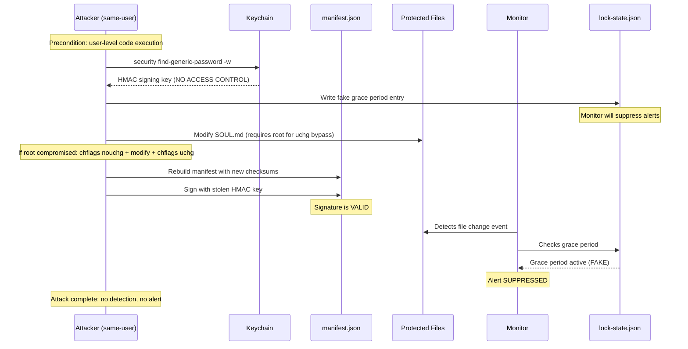
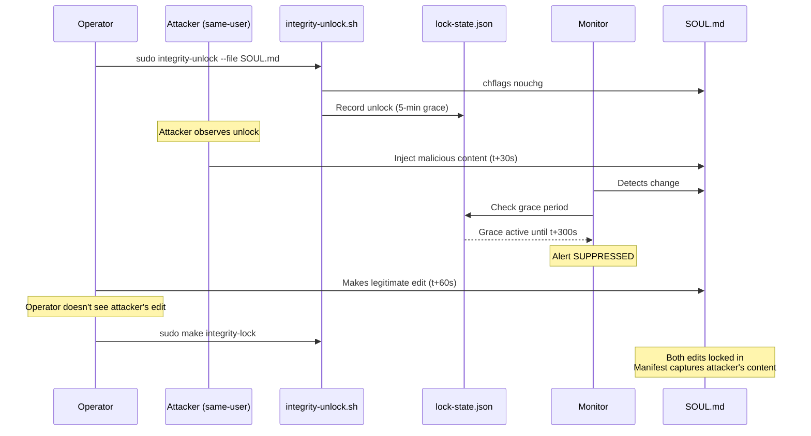
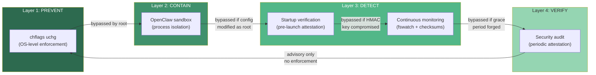

# Adversarial Review: Workspace Integrity System

**Date**: 2026-03-23
**Posture**: Zero-trust, state-actor threat model (unlimited resources, supply chain compromise assumed)
**Scope**: All scripts, specs, and runtime state for 011-workspace-integrity
**Reviewer**: Claude Opus 4.6 (automated adversarial analysis)

---

## Table of Contents

1. [Security Zone Architecture](#1-security-zone-architecture)
2. [Trust Boundary Analysis](#2-trust-boundary-analysis)
3. [Defense-in-Depth Proof](#3-defense-in-depth-proof)
4. [Findings by Severity](#4-findings-by-severity)
5. [Incident Response Assessment](#5-incident-response-assessment)
6. [Audit Log Integrity](#6-audit-log-integrity)
7. [Detection Guarantees](#7-detection-guarantees)
8. [Blind Spots](#8-blind-spots)
9. [Terminology Alignment](#9-terminology-alignment)
10. [Recommendations](#10-recommendations)
11. [Content Note Material](#11-content-note-material)

---

## 1. Security Zone Architecture

### Security Zones (Mermaid)

```mermaid
graph TB
    subgraph TZ1["Trust Zone 1: Operator Authority"]
        direction TB
        OP[Operator<br/>sudo privileges]
        KC[macOS Keychain<br/>HMAC signing key]
        LOCK["integrity-lock.sh<br/>integrity-unlock.sh"]
        DEPLOY["integrity-deploy.sh"]
    end

    subgraph TZ2["Trust Zone 2: Instruction Governance"]
        direction TB
        MF["manifest.json<br/>HMAC-signed"]
        PF["Protected Files<br/>uchg immutable"]
        AL["skill-allowlist.json<br/>content hashes"]
        LS["lock-state.json<br/>grace periods"]
    end

    subgraph TZ3["Trust Zone 3: Runtime Isolation"]
        direction TB
        AGENT["linkedin-persona<br/>sandbox: ro workspace"]
        EXTRACT["feed-extractor<br/>sandbox: zero tools"]
        WD["writable data dir<br/>pending-drafts.json"]
    end

    subgraph TZ4["Trust Zone 4: Detection Layer"]
        direction TB
        VERIFY["integrity-verify.sh<br/>pre-launch attestation"]
        MON["integrity-monitor.sh<br/>continuous verification"]
        HB["heartbeat.json"]
        AUDIT["hardening-audit.sh<br/>periodic attestation"]
    end

    subgraph TZ5["Trust Zone 5: External Services"]
        direction TB
        N8N["n8n container<br/>Docker"]
        WH["Webhook endpoints"]
    end

    OP -->|"sudo chflags"| PF
    OP -->|"signs"| MF
    KC -->|"HMAC key"| MF
    DEPLOY -->|"builds"| MF
    LOCK -->|"sets uchg"| PF
    LOCK -->|"clears"| LS

    VERIFY -->|"reads"| MF
    VERIFY -->|"checksums"| PF
    VERIFY -->|"validates"| WD
    VERIFY -->|"exec"| AGENT
    MON -->|"watches"| PF
    MON -->|"reads"| LS
    MON -->|"writes"| HB
    MON -->|"alerts via"| WH

    AGENT -->|"reads only"| PF
    AGENT -->|"reads/writes"| WD
    AGENT -->|"calls"| WH
    EXTRACT -.->|"no access"| PF

    AUDIT -->|"verifies"| PF
    AUDIT -->|"verifies"| MF
    AUDIT -->|"checks"| MON

    N8N -->|"receives"| WH

    classDef critical fill:#ff6b6b,stroke:#333,color:#fff
    classDef warning fill:#ffd93d,stroke:#333
    classDef safe fill:#6bcb77,stroke:#333

    class KC critical
    class LS,HB warning
    class PF safe
```

### Attack Sequence: Manifest Forgery (State Actor)

### Attack Sequence: Grace Period Exploitation

### Defense Layer Interaction

---

## 2. Trust Boundary Analysis

### Boundary 1: Operator Authority -> Filesystem

| Property | Status | Evidence |
|----------|--------|----------|
| Immutable flags prevent non-root writes | ENFORCED | `chflags uchg` is kernel-level; verified in T012 |
| Root required for flag modification | ENFORCED | macOS kernel enforces `uchg` semantics |
| Sudo audit trail | PARTIAL | `$SUDO_USER` recorded in lock-state, but no persistent audit log |

### Boundary 2: Manifest -> Trust Anchor (Keychain)

| Property | Status | Evidence |
|----------|--------|----------|
| HMAC key stored in Keychain | ENFORCED | `security add-generic-password` |
| Key accessible only to operator | **VIOLATED** | Any same-user process can call `security find-generic-password -w` |
| Manifest signature prevents forgery | **VIOLATED** | Attacker with key can re-sign |

### Boundary 3: Agent Process -> Sandbox

| Property | Status | Evidence |
|----------|--------|----------|
| Read-only workspace | CONFIGURED | `workspaceAccess: "ro"` in openclaw.json |
| Tool restrictions | CONFIGURED | `tools.deny` list per agent |
| Config immutability at runtime | **NOT VERIFIED** | No runtime re-check of sandbox config |

### Boundary 4: Monitor -> Alert Delivery

| Property | Status | Evidence |
|----------|--------|----------|
| File changes detected | BEST-EFFORT | fswatch 1s latency, not guaranteed |
| Alerts delivered | BEST-EFFORT | curl to n8n webhook, no retry, no ACK |
| Grace period authentic | **VIOLATED** | lock-state.json writable by any same-user process |

### Boundary 5: External Services (n8n)

| Property | Status | Evidence |
|----------|--------|----------|
| n8n container integrity | NOT VERIFIED | No image hash check before `docker exec` |
| Webhook authenticity | NOT VERIFIED | Alert payload not HMAC-signed |

---

## 3. Defense-in-Depth Proof

### What Each Layer Actually Prevents

| Attack | Layer 1 (uchg) | Layer 2 (sandbox) | Layer 3 (detect) | Layer 4 (audit) |
|--------|:-:|:-:|:-:|:-:|
| Agent self-modifies SOUL.md | BLOCKS | BLOCKS (ro) | detects | detects |
| Agent reads .env secrets | allows | BLOCKS (workspaceOnly) | n/a | detects |
| Same-user process modifies file | BLOCKS | n/a | detects | detects |
| Root modifies file | allows | allows | detects* | detects* |
| Root + HMAC key compromise | allows | allows | **EVADES** | **EVADES** |
| Root + grace period forgery | allows | allows | **EVADES** | detects (post-hoc) |
| Supply chain (fswatch replaced) | allows | allows | **EVADES** | **EVADES** |
| Memory-resident attack | allows | allows | **INVISIBLE** | **INVISIBLE** |

*"detects" = if attacker doesn't also compromise the detection layer

### Defense-in-Depth Verdict

The system provides **genuine layered defense** against agent-level and same-user threats. However, **root compromise collapses all four layers** because:

1. Root can clear uchg flags
2. Root can modify sandbox config
3. Root can read the HMAC key and forge manifests
4. Root can write fake grace periods to suppress alerts

**This is the fundamental architectural limitation**: all trust is rooted in the operator's user account and Keychain, which are accessible to root. The spec acknowledges this (spec.md line 230) but the implications cascade further than documented.

---

## 4. Findings by Severity

### CRITICAL

| ID | Finding | Impact | Exploitability |
|----|---------|--------|----------------|
| ADV-001 | **HMAC key accessible to same-user processes**. Keychain auto-unlocks on login. Any process running as the operator can extract the signing key and forge manifests. | Complete bypass of integrity detection | Low barrier: `security find-generic-password -w` |
| ADV-002 | **lock-state.json is unsigned and writable**. Attacker can inject fake grace periods to suppress monitor alerts indefinitely. Combined with ADV-001, enables undetected modification. | Silent alert suppression | Low barrier: `jq` write to lock-state.json |
| ADV-003 | **No out-of-band verification**. All verification uses the same trust anchor (Keychain HMAC). If the key is compromised, the entire verification chain is compromised. No external commitment (git signature, remote attestation) to detect this. | Undetectable total compromise | Requires root + Keychain access |

### HIGH

| ID | Finding | Impact | Exploitability |
|----|---------|--------|----------------|
| ADV-004 | **Heartbeat file unauthenticated**. Attacker can forge heartbeat to mask dead monitor. `integrity_write_heartbeat` uses no signing. | Operator trusts dead monitor | Write `jq` to heartbeat file |
| ADV-005 | **Monitor logs writable by agent**. `~/.openclaw/logs/` owned by operator. Compromised agent can tamper with or delete monitor logs. | Post-compromise log destruction | Agent runs as same user |
| ADV-006 | **No persistent unlock audit trail**. `integrity-lock.sh` calls `integrity_clear_lockstate()` which erases all unlock history. After lock, no record of who unlocked what. | Accountability gap; forensic dead end | By design |
| ADV-007 | **Environment variable validation incomplete**. Only checks `DYLD_INSERT_LIBRARIES` and `NODE_OPTIONS`. Missing: `DYLD_FRAMEWORK_PATH`, `DYLD_LIBRARY_PATH`, `HOME`, `TMPDIR`, `LD_PRELOAD` (if running Linux binaries). | Env-based injection bypasses startup check | Set env var before running verify |
| ADV-008 | **Sourced libraries not integrity-checked before sourcing**. All scripts `source lib/integrity.sh` before any integrity verification runs. If lib is compromised, all checks are compromised. | Single point of failure | Requires root to modify locked lib |
| ADV-009 | **n8n container integrity not verified**. `docker exec n8n` assumes the running container is legitimate. No image hash verification. | Fake container could export fake workflows | Docker access required |

### MEDIUM

| ID | Finding | Impact | Exploitability |
|----|---------|--------|----------------|
| ADV-010 | **Manifest has no version history**. Updated in-place during lock. Rollback attacks possible if attacker can restore old manifest. | Attacker can rollback to weaker state | Root + HMAC key |
| ADV-011 | **Atomic writes inconsistent**. `sandbox-setup.sh` and `skill-allowlist.sh` use mktemp+mv pattern. `integrity-unlock.sh` (lock-state.json) and `integrity-monitor.sh` (heartbeat) do not. | State corruption on interrupted write | Kill process mid-write |
| ADV-012 | **Audit checks are advisory only**. `hardening-audit.sh` reports PASS/FAIL but doesn't block agent launch. Operator can ignore FAIL results. | Security controls not enforced | Operator negligence |
| ADV-013 | **TOCTOU in symlink detection**. `integrity_check_symlinks` iterates files sequentially. Attacker can create symlink between check and lock. | Symlink planted during lock window | Race condition timing |
| ADV-014 | **pending-drafts.json validation incomplete**. Missing: UUID format for `id`, enum validation for `type`/`status`, ISO-8601 for `created_at`. Content field allows arbitrary text up to 5000 chars. | Prompt injection via data file | Write to writable data dir |
| ADV-015 | **jq key ordering in HMAC computation**. `jq -c` output is deterministic for same input but specification doesn't guarantee cross-version stability. Future jq update could break signature verification. | Signature verification fragile | jq version change |

### LOW

| ID | Finding | Impact | Exploitability |
|----|---------|--------|----------------|
| ADV-016 | **Alert delivery best-effort**. `curl --max-time 5` with no retry. Failed webhook = lost alert. | Missed alert during n8n downtime | n8n offline |
| ADV-017 | **Operator identity from `whoami` not `$SUDO_USER`**. Lock-state records process user, not the human who invoked sudo. | Weak accountability on shared systems | Shared account |
| ADV-018 | **macOS `head -n -1` incompatibility**. Used in phase5 verification script cleanup. GNU syntax, not macOS-compatible. | Test cleanup incomplete | Cosmetic |

---

## 5. Incident Response Assessment

### Andon Cords (Emergency Stops)

| Cord | Mechanism | Effectiveness | Gap |
|------|-----------|---------------|-----|
| **Lock all files** | `sudo make integrity-lock` | HIGH — kernel-enforced | Requires sudo; no single "panic button" |
| **Stop agent** | Kill OpenClaw process | HIGH — immediate | No persistent "agent disabled" flag |
| **Stop monitoring** | `make monitor-teardown` | HIGH — unloads LaunchAgent | Halts detection; attacker wins if timed |
| **Network isolation** | Disconnect network | HIGH — blocks all external comms | Manual; doesn't stop local attacks |
| **Sandbox teardown** | `make sandbox-teardown` | MEDIUM — removes config | Agent must be restarted for effect |

### Missing Andon Cords

1. **No "quarantine mode"** — no single command to: lock all files + kill agent + preserve logs + alert externally
2. **No "agent kill switch"** — no persistent flag that prevents agent from starting across reboots
3. **No "evidence preservation"** — no command to snapshot current state (manifest + logs + file hashes) to an immutable location before recovery actions begin
4. **No escalation path** — alerts go to n8n webhook (same system); no out-of-band notification (email, SMS, push notification)

### Recovery Procedures

| Scenario | Recovery Steps | Time | Risk |
|----------|---------------|------|------|
| File tampered, detected by monitor | 1. `git checkout <file>` 2. `make integrity-deploy` 3. `sudo make integrity-lock` | 5-10 min | Low — git is the source of truth |
| Manifest forged (HMAC key compromised) | 1. Rotate Keychain key 2. Full redeploy 3. Verify ALL files against git | 15-30 min | HIGH — can you trust the scripts? |
| Monitor killed | `make monitor-teardown && make monitor-setup` | 1 min | LOW — LaunchAgent auto-restarts |
| Signing key deleted from Keychain | `make integrity-keygen` + full redeploy | 5 min | MEDIUM — old manifests invalid |
| Scripts directory compromised | Boot from Time Machine or known-good git clone | 30+ min | HIGH — trust nothing on disk |

### Recovery Trust Problem

**After a detected breach, what can you trust?**

| Artifact | Trustworthy? | Reason |
|----------|:---:|--------|
| git repository | YES (if .git not compromised) | Git objects are content-addressed |
| Protected files on disk | NO | Could be modified by root |
| manifest.json | NO | Could be re-signed with stolen key |
| lock-state.json | NO | Not signed, writable |
| heartbeat.json | NO | Not signed, writable |
| Keychain signing key | UNKNOWN | May have been extracted |
| Scripts (*.sh) | NO | Could be modified by root |
| Monitoring logs | NO | Writable by same-user |
| openclaw.json | NO | Could be modified by root |

**The only reliable recovery source is git** (assuming `.git/` directory integrity, which is protected by uchg flags on the scripts directory).

---

## 6. Audit Log Integrity

### Current Logging Landscape

| Event | Logged? | Where | Tamper-Resistant? |
|-------|:-------:|-------|:-----------------:|
| File modification detected | YES | monitor stdout log | NO |
| Alert sent to operator | YES | monitor stdout log | NO |
| Alert delivery failure | YES | monitor stderr log | NO |
| File locked | NO | — | — |
| File unlocked | PARTIAL | lock-state.json (cleared on re-lock) | NO |
| Manifest rebuilt | NO | — | — |
| Manifest signature verified | NO | — | — |
| Integrity check passed/failed | stdout only | not persisted | — |
| Sandbox configured | NO | — | — |
| Skill added to allowlist | NO | — | — |
| Audit run results | stdout or JSON file | if `--json` used | NO |
| Heartbeat written | YES | heartbeat.json | NO |
| Monitor started/stopped | YES | launchd system log | PARTIAL (syslog) |

### Critical Logging Gaps

1. **No append-only audit log**. All state files are overwritten, not appended. History is destroyed on every operation.
2. **No log signing**. Monitor logs at `~/.openclaw/logs/` are plain text, writable by the operator user.
3. **No centralized event stream**. Events are scattered: lock-state.json, heartbeat.json, monitor logs, audit output, launchd syslog.
4. **Unlock history destroyed on lock**. `integrity_clear_lockstate()` erases all unlock records.
5. **No forensic snapshot capability**. No command to capture current state as evidence before recovery begins.

### Could Logs Be Compromised?

**YES**. An attacker with user-level access can:
- Modify `~/.openclaw/logs/integrity-monitor.out.log` (overwrite evidence)
- Write false entries to `lock-state.json` (suppress alerts)
- Forge `heartbeat.json` (mask dead monitor)
- Delete all log files

**The system becomes an opaque box after compromise** because the logs themselves are not trustworthy.

---

## 7. Detection Guarantees

### What Is GUARANTEED to Be Detected

| Attack | Detection Mechanism | Guarantee Level |
|--------|-------------------|-----------------|
| Agent writes to locked file | macOS kernel returns EPERM | KERNEL-ENFORCED |
| Non-root modifies locked file | macOS kernel returns EPERM | KERNEL-ENFORCED |
| File modified + manifest NOT updated | `integrity-verify.sh` checksum mismatch | HIGH (if verify runs) |
| Symlink in protected directory at lock time | `integrity_check_symlinks` scan | HIGH (if lock runs) |
| Unapproved skill installed | `check_skill_allowlist` hash mismatch | HIGH (if verify runs) |
| `NODE_OPTIONS` env injection | `integrity_check_env_vars` | HIGH (if verify runs) |

### What CANNOT Be Detected

| Attack | Why Invisible | Residual Risk |
|--------|--------------|---------------|
| Root + HMAC key re-signs manifest | Valid signature; checksums match attacker's files | CRITICAL |
| Grace period forged in lock-state.json | File not signed; monitor trusts it | CRITICAL |
| Heartbeat forged | File not signed; verify trusts it | HIGH |
| fswatch killed + files modified + fswatch restarted | Events during downtime are lost forever | HIGH |
| Memory-resident attack (no disk writes) | System only monitors filesystem | OUT OF SCOPE |
| Supply chain (compromised jq/fswatch binary) | No binary attestation | HIGH |
| Timing attack during grace period | Legitimate grace window used by attacker | MEDIUM |
| n8n container replaced | No image hash verification | MEDIUM |
| Log deletion after compromise | Logs not immutable | HIGH |

### Detection Latency

| Attack Vector | Best Case | Worst Case |
|---------------|-----------|------------|
| File modification (monitor running) | ~1 second (fswatch latency) | Never (if grace period forged) |
| File modification (monitor dead) | Next `integrity-verify` run | Never (if never run) |
| Manifest forgery | Next audit comparison to git | Never (no out-of-band check) |
| Sandbox config change | Next `integrity-verify` run | Never (if verify bypassed) |
| Skill tampering | Next `integrity-verify` run | Never (if verify bypassed) |

---

## 8. Blind Spots

### Structural Blind Spots

1. **No separation of key management from key use**. The HMAC key is stored where the agent can reach it (login Keychain). A Hardware Security Module (HSM) or Secure Enclave integration would provide genuine key isolation.

2. **No external commitment**. The manifest is self-contained — it attests its own integrity. There is no external witness (e.g., blockchain timestamp, remote attestation service, signed git tag) that could detect manifest replacement.

3. **Single-user trust collapse**. Every security boundary depends on the operator's user account permissions. If any process running as this user is compromised, all boundaries are compromised. The sandbox is the only layer that adds genuine process-level isolation.

4. **Boot-time gap**. Between system boot and first `integrity-verify` run, there is no integrity checking. An attacker with physical access can modify files in Recovery Mode and boot normally.

5. **No file content sanitization**. Protected files (SOUL.md, AGENTS.md) contain natural language that the agent interprets. Even if the file is cryptographically verified, the *content* could contain adversarial instructions that were legitimately committed. The integrity system protects against unauthorized changes, not against malicious content in authorized changes.

6. **Monitoring is detection, not prevention**. The monitor detects changes after they happen. By the time an alert fires, the agent may have already loaded the tampered file. The only true prevention layer is the uchg immutable flag.

### Operational Blind Spots

7. **No operator training materials**. No runbook for incident response. No documented "if you see this alert, do this" procedures.

8. **No canary files**. No decoy files that should never be accessed/modified, which would indicate an active attacker exploring the filesystem.

9. **No drift detection**. No mechanism to compare current deployed state against a "known good" baseline beyond the manifest (which can be forged).

10. **No alerting on alert failure**. If n8n is down and alert delivery fails, nobody knows. The monitor logs a warning, but nobody reads the log in real-time.

---

## 9. Terminology Alignment

### Recommended Updates (ToIP / NIST 800-53 / ISO 27001)

| Current Term | Recommended | Standard Reference |
|-------------|-------------|-------------------|
| "tampering" | "unauthorized modification" (for actions); "integrity violation" (for detected state) | NIST 800-53 SI-7 |
| "alert" | "security event" or "integrity event" | ISO 27001 A.12.4.1 |
| "protected files" | "governed artifacts" (for all); subcategories: "instruction files" (SOUL.md), "control files" (CLAUDE.md), "credential files" (.env) | ToIP Governance Framework |
| "signing key" | "trust anchor" | ToIP Trust Registry |
| `check_*()` functions in verify.sh | `attest_*()` for startup (proves state at T0); `verify_*()` for continuous | NIST attestation vs verification distinction |
| `send_alert()` | `emit_integrity_event()` | SIEM integration convention |
| "integrity check" | "pre-launch attestation" (startup) or "continuous verification" (monitor) | ISO 27001 A.14.2 |
| "skill allowlist" | "skill governance registry" | ToIP Trust Registry |
| "grace period" | "authorized modification window" | More precise; avoids confusion with retry semantics |

### Cross-File Inconsistencies Found

| Term | Used In | Also Called In |
|------|---------|---------------|
| Protected files | spec.md, integrity.sh | "workspace files" (plan.md), "monitored files" (monitor.sh) |
| Signing key | integrity.sh | "manifest key" (spec.md), "HMAC key" (deploy.sh) |
| Immutable flag | lock.sh | "uchg flag" (audit), "write-protection" (spec.md) |
| Integrity check | verify.sh | "startup check" (tasks.md), "pre-flight check" (plan.md) |

---

## 10. Recommendations

### Immediate (Address Before Production)

| Priority | Finding | Remediation |
|----------|---------|-------------|
| P0 | ADV-002: lock-state.json unsigned | Sign lock-state.json with HMAC. Verify signature in monitor before trusting grace period. |
| P0 | ADV-004: heartbeat.json unsigned | Sign heartbeat with HMAC. Verify in `integrity_check_heartbeat`. |
| P0 | ADV-006: No unlock audit trail | Append unlock events to an append-only audit log (`~/.openclaw/audit.log`) that persists across lock operations. |
| P1 | ADV-001: HMAC key accessible | Investigate Keychain access group restrictions or move key to a per-application Keychain that requires explicit operator approval on each access. |
| P1 | ADV-007: Incomplete env var checks | Add: `DYLD_FRAMEWORK_PATH`, `DYLD_LIBRARY_PATH`, `HOME` (verify equals expected), `TMPDIR`. |
| P1 | ADV-005: Logs writable | Create append-only log file (chflags uappnd) for critical security events. |

### Short-Term (Before M4 Complete)

| Priority | Finding | Remediation |
|----------|---------|-------------|
| P2 | ADV-003: No out-of-band verification | Sign manifests with git (gpg-signed commit of manifest hash). Provides external commitment. |
| P2 | ADV-008: Sourced libs not verified | Add inline SHA-256 check of `lib/integrity.sh` before sourcing, using only builtins (`shasum` is in `/usr/bin`). |
| P2 | ADV-011: Inconsistent atomic writes | Apply mktemp+mv pattern to lock-state.json and heartbeat.json writes. |
| P2 | ADV-012: Audit advisory only | Add `--enforce` flag to audit that returns non-zero on FAIL, integrate with `integrity-verify.sh`. |
| P2 | ADV-009: n8n container not verified | Before `docker exec`, verify image ID matches expected hash. |

### Medium-Term (Post-M4)

| Priority | Finding | Remediation |
|----------|---------|-------------|
| P3 | ADV-010: No manifest versioning | Store manifest history in git or append-only log. Detect rollback attacks. |
| P3 | ADV-014: pending-drafts validation | Add UUID regex, enum validation, ISO-8601 format checks. |
| P3 | Blind Spot #8: Canary files | Deploy honeypot files in agent workspace that should never be read. Monitor for access. |
| P3 | Blind Spot #10: Alert-on-alert-failure | Implement dead man's switch: if no heartbeat for N minutes, send out-of-band notification (macOS notification center, email via `sendmail`). |
| P3 | ADV-015: jq ordering stability | Use `jq --sort-keys` consistently in all HMAC computations. |

---

## 11. Content Note Material

### For LinkedIn / Social Content

**Theme**: "Building integrity systems for self-hosted AI agents: what we learned from adversarial review"

**Key Insights**:

1. **The HMAC-in-Keychain paradox**: We store the manifest signing key in macOS Keychain for convenience — but any same-user process can read it. The very agent we're protecting could forge its own integrity attestation. Defense-in-depth means the sandbox must prevent the agent from reaching the Keychain, but if the sandbox is ever bypassed, the entire integrity chain collapses. *Lesson: your trust anchor must be in a different security domain than the thing you're protecting.*

2. **Grace periods are attack windows**: We implemented a 5-minute unlock grace period so operators can edit files without triggering alerts. But an attacker who can write to `lock-state.json` (which is just a JSON file owned by the user) can fake grace periods forever. The monitoring layer's alert suppression feature became its own vulnerability. *Lesson: every convenience mechanism is a potential bypass. If you add a "don't alert me" feature, an attacker will use it too.*

3. **Detection != Prevention**: Our 4-layer defense (Prevent → Contain → Detect → Verify) looks great on paper. But when we proved each layer against a state actor, we found that root compromise collapses all four layers because they share the same trust anchor. The only genuine prevention is the kernel-level `uchg` flag — everything else is detection with varying latency. *Lesson: be honest about which controls prevent vs detect. The diagram should show this distinction.*

4. **The opaque box problem**: After a breach, can you trust your own logs? Our monitor logs are writable by the same user the agent runs as. An attacker who compromises the agent can delete evidence. The system becomes an opaque box where you can't reconstruct what happened. *Lesson: security-critical logs must be append-only or written to an external system the attacker can't reach.*

5. **Bugs found by testing what we built**: During verification, we discovered that `find -type f` doesn't find symlinks (attacker can plant invisible symlinks), shell functions that return via `echo` get stdout contaminated by log messages, and `>` redirect truncates files before `jq` even starts parsing (destroying config on error). These aren't theoretical — they're bugs we shipped and caught in verification. *Lesson: adversarial testing finds what unit tests miss.*

---

## Appendix: Files Reviewed

| File | Lines | Purpose |
|------|-------|---------|
| scripts/lib/integrity.sh | 330 | Shared library: checksums, HMAC, symlinks, heartbeat |
| scripts/integrity-verify.sh | 460 | Pre-launch attestation (10 checks) |
| scripts/integrity-monitor.sh | 230 | Continuous filesystem monitoring |
| scripts/integrity-lock.sh | 85 | Set immutable flags |
| scripts/integrity-unlock.sh | 100 | Per-file unlock with grace period |
| scripts/integrity-deploy.sh | 130 | Build and sign manifest |
| scripts/sandbox-setup.sh | 175 | Configure agent sandbox |
| scripts/sandbox-teardown.sh | 75 | Remove sandbox config |
| scripts/skill-allowlist.sh | 210 | Manage skill content hashes |
| scripts/hardening-audit.sh | 2600 | Security audit (8 new CHK-OPENCLAW-* checks) |
| specs/011-workspace-integrity/spec.md | ~250 | Feature specification |
| specs/011-workspace-integrity/plan.md | ~250 | Implementation plan |
| specs/011-workspace-integrity/research.md | ~560 | Research decisions |
| scripts/templates/com.openclaw.integrity-monitor.plist | 30 | LaunchAgent config |
